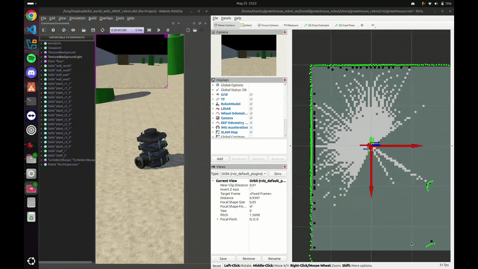

# 🌱 Autonomous Greenhouse Robot — Sensor Fusion & ROS 2 Navigation

A fully autonomous **TurtleBot3 Burger** robot simulated in **Webots R2023b** with **ROS 2 Jazzy** on Ubuntu 24.04. The robot navigates a custom 12×12 metre greenhouse, builds a real-time SLAM map, fuses three sensors through an EKF for drift-free localisation, and overlays real environmental sensor data from a Kaggle dataset as colour-coded zone markers in RViz2.

---

<!-- 🎬 DEMO GIF — upload your gif to this repo and rename it to demo.gif, or change the filename below -->


---

## 👥 Team MVAL

| Member | Responsibility |
|--------|---------------|
| **Vlad Enache** | Project motivation, hardware & simulation environment |
| **Antonio Dumitrascu** | SLAM mapping, EKF sensor fusion |
| **Lucian Dumitru** | Autonomous navigation (Nav2), real sensor data integration |
| **Marius Ciobanu** | Live demo, ROS 2 integration, bibliography |

---

## 🎯 Project Motivation

- Address **labour shortages** and rising operational costs in modern agriculture
- Enhance **precision agriculture** through data-driven monitoring and task automation
- Improve **crop yield and quality** by enabling timely interventions based on real-time environmental data
- Develop a robust, scalable robotics platform using the **ROS 2 ecosystem** for autonomous operations in semi-structured greenhouse environments

---

## ✨ Features

- **5 Sensors**: LiDAR (LDS-01 360°), Wheel Encoders, IMU (Gyro/Accelerometer), Magnetometer (Compass), RGB Camera
- **3-Sensor EKF Fusion**: Fuses wheel odometry + IMU + magnetometer → `/odometry/filtered`
- **SLAM Mapping**: Real-time 2D occupancy grid at **5 cm resolution** using SLAM Toolbox (async online mode)
- **Autonomous Navigation**: Nav2 stack with **A\* global planner** and **DWB local controller**; set goals via RViz2
- **Real Greenhouse Data**: Real-world Kaggle CSV dataset mapped to 6 spatial zones, visualised as colour-coded 3D cylinders in RViz2

---

## 🤖 Hardware & Simulation Environment

| Item | Detail |
|------|--------|
| Robot Platform | TurtleBot3 Burger |
| Drive System | Differential drive |
| Simulator | Webots R2023b (physics-based) |
| World | Custom 12×12 m greenhouse with plant rows and walls |
| ROS 2 Version | Jazzy Jalisco on Ubuntu 24.04 |
| ROS 2 Bridge | `webots_ros2_driver` for seamless ROS 2 integration |

### Sensors

| # | Sensor | ROS Topic | Purpose |
|---|--------|-----------|---------|
| 1 | LiDAR (LDS-01) | `/scan` | 360° laser scan — detects walls and obstacles |
| 2 | Wheel Encoders | `/odom` | Counts wheel rotations → short-term position estimate |
| 3 | IMU (Gyro + Accel) | `/imu` | Fast rotation rate and acceleration → heading |
| 4 | Magnetometer (Compass) | `/compass/imu` | Absolute north heading — prevents gyro drift |
| 5 | RGB Camera | `/camera/image_raw/image_color` | Front-facing visual feed |

---

## 🧠 Sensor Fusion — EKF

An **Extended Kalman Filter (EKF)** from the `robot_localization` package fuses data from three complementary sensors into a single, highly accurate and stable pose estimate on `/odometry/filtered`.

```
Wheel Encoders (/odom)      ──→ ┌─────────┐
  • position (x, y)              │         │
  • forward velocity             │   EKF   │──→ /odometry/filtered
                                 │ (fused) │
IMU (/imu)                 ──→  │         │
  • yaw, yaw rate, accel         │         │
                                 │         │
Magnetometer (/compass/imu) ──→ └─────────┘
  • absolute heading
```

### Why three sensors?

| Sensor | Strength | Weakness |
|--------|----------|----------|
| Wheel Encoders | Short-term position accuracy | Drifts over time due to wheel slippage |
| IMU | Fast, smooth orientation data (yaw rate) | Gyroscope drifts without an absolute reference |
| Magnetometer | Absolute, non-drifting heading relative to magnetic north | Noisy; susceptible to local magnetic interference |

The EKF combines all three — compensating for each sensor's individual weakness — to produce a robust, drift-free localisation output.

---

## 🗺️ SLAM Mapping

- **Package**: `slam_toolbox` in **asynchronous online mode**
- **Primary Input**: 360° LiDAR scans (`/scan`)
- **Process**: Performs scan matching against the fused EKF pose to build a map and simultaneously correct for long-term drift
- **Output**: 2D occupancy grid map (`/map`) at **5 cm resolution**
  - ⬜ White = Free space
  - ⬛ Black = Obstacle
  - 🔲 Gray = Unexplored

The map forms the static foundation for all autonomous navigation.

---

## 🧭 Autonomous Navigation — Nav2

Nav2 coordinates planning and control via a **Behaviour Tree**.

| Component | Detail |
|-----------|--------|
| **Global Planner** | NavPlanner **(A\* algorithm)** — computes the shortest obstacle-free path from current pose to the goal on the static map |
| **Local Controller** | **DWB (Dynamic Window Approach)** — follows the global path while dynamically avoiding new obstacles detected by LiDAR |
| Global Costmap | Covers the entire 12×12 m environment |
| Local Costmap | 3×3 m area that moves with the robot |

---

## 📊 Real Sensor Data Integration

A Python ROS 2 node reads a real-world greenhouse CSV from **Kaggle** and publishes colour-coded zone markers to RViz2, overlaying them onto the SLAM map. The robot can be commanded to autonomously navigate to zones based on their health status.

**Dataset:** Greenhouse Sensor Data (10-minute interval) — Marcel Boonman (Kaggle)

| Zone | Temperature | Humidity | CO₂ (ppm) | Status | Marker |
|------|------------|----------|-----------|--------|--------|
| Zone_1 | 32.0°C | 25.0% | 1450 | 🔴 CRITICAL | Red |
| Zone_2 | 27.0°C | 55.0% | 1068 | 🟡 WARNING | Yellow |
| Zone_3 | 13.1°C | 68.4% | 1023 | 🟢 GOOD | Green |
| Zone_4 | 13.0°C | 68.5% | 996 | 🟢 GOOD | Green |
| Zone_5 | 12.9°C | 68.6% | 961 | 🟢 GOOD | Green |
| Zone_6 | 12.9°C | 68.7% | 943 | 🟢 GOOD | Green |

**Colour logic (by humidity):**

| Colour | Humidity | Meaning |
|--------|----------|---------|
| 🔴 Red | < 50% | Critical — requires immediate intervention |
| 🟡 Yellow | 50–65% | Warning — monitor closely |
| 🟢 Green | > 65% | Healthy — conditions are optimal |

---

## 🗺️ System Architecture

### Data Flow

```
Webots Simulator (12×12 m greenhouse)
    ↓ publishes
/scan, /odom, /imu, /compass/values, /camera
    ↓
┌──────────────────────────────────────────────────────┐
│  EKF (fuses odom + imu + compass)                    │→ /odometry/filtered
│  SLAM Toolbox (async, 5cm res, scan-matching + EKF)  │→ /map
│  Nav2 A* planner + DWB controller                    │→ /cmd_vel_nav
│  Twist Relay (Twist → TwistStamped)                  │→ /cmd_vel → motors
│  Data Visualiser (Kaggle CSV → RViz2 markers)        │→ /greenhouse_zones
└──────────────────────────────────────────────────────┘
```

### TF Tree

```
map  (from SLAM)
 └── odom  (from EKF)
      └── base_link  (robot body)
           ├── LDS-01       (LiDAR)
           ├── camera_link  (RGB camera)
           ├── left_wheel_link
           └── right_wheel_link
```

### Velocity Command Chain

```
RViz2 "2D Goal Pose"
  → Nav2 A* planner → DWB controller
  → /cmd_vel_nav (Twist)
  → twist_relay node
  → /cmd_vel (TwistStamped)
  → wheels
```

---

## ⚙️ Prerequisites

| Requirement | Version |
|-------------|---------|
| OS | Ubuntu 24.04 |
| ROS 2 | Jazzy Jalisco |
| Webots | R2023b+ (at `/usr/local/webots`) |
| Python | 3.12+ |

**Required ROS 2 packages:**
- `nav2`
- `slam_toolbox`
- `robot_localization`
- `ros2_control`
- `webots_ros2_driver`
- `teleop_twist_keyboard` *(optional)*

---

## 🔨 Build

```bash
cd ~/greenhouse_robot_ws
source /opt/ros/jazzy/setup.bash
colcon build
source install/setup.bash
```

---

## 🚀 Run

### Launch Everything

```bash
cd ~/greenhouse_robot_ws && \
source /opt/ros/jazzy/setup.bash && \
source install/setup.bash && \
ros2 launch greenhouse_robot greenhouse_launch.py
```

Wait ~30 seconds until you see:
```
Managed nodes are active
=== SLAM ACTIVATED ===
```

RViz2 opens automatically with the full display layout.

### Navigate the Robot

1. In RViz2, click **"2D Goal Pose"** in the toolbar
2. Click and drag anywhere on the map — the robot computes an A* path and navigates autonomously
3. Red line = global plan (A*), Blue line = local plan (DWB)

### View Greenhouse Zone Markers

1. In RViz2, click **Add** (bottom-left of Displays panel)
2. Select **By Topic** tab
3. Find `/greenhouse_zones` → expand → select **MarkerArray** → click OK
4. Colour-coded cylinders with labels appear on the map

### Manual Control (optional)

```bash
source /opt/ros/jazzy/setup.bash && source ~/greenhouse_robot_ws/install/setup.bash
ros2 run teleop_twist_keyboard teleop_twist_keyboard \
  --ros-args -p stamped:=true -p frame_id:=base_link
```

Keys: `i` = forward, `j` = turn left, `l` = turn right, `k` = stop

---

## 📁 Project Structure

```
greenhouse_robot_ws/src/greenhouse_robot/
├── launch/
│   └── greenhouse_launch.py           # Master launch file
├── config/
│   ├── ekf.yaml                       # EKF: 3-sensor configuration
│   ├── slam_toolbox.yaml              # SLAM async online, 5 cm resolution
│   ├── nav2_params.yaml               # Nav2: A* + DWB configuration
│   ├── ros2control.yml                # Motor controller config
│   └── processed_sensor_data.csv      # Real Kaggle data (6 zones)
├── worlds/
│   └── greenhouse.wbt                 # Webots 12×12 m greenhouse world
├── resource/
│   └── greenhouse_turtlebot.urdf      # Robot → ROS 2 device mapping
├── rviz/
│   └── greenhouse.rviz                # RViz2 display layout
├── greenhouse_robot/
│   ├── twist_relay.py                 # Twist → TwistStamped converter
│   ├── compass_to_imu.py              # Compass values → IMU yaw for EKF
│   └── greenhouse_data_visualizer.py  # CSV → colour-coded RViz2 markers
└── package.xml
```

---

## 🔧 Useful Commands

### Source first (every new terminal)

```bash
source /opt/ros/jazzy/setup.bash
source ~/greenhouse_robot_ws/install/setup.bash
```

### Verify the system

```bash
ros2 node list                      # ~15 nodes
ros2 topic list                     # 50+ topics
ros2 topic hz /scan                 # ~5–10 Hz
ros2 topic hz /odom                 # ~20 Hz
ros2 topic hz /compass/imu          # ~18 Hz
ros2 topic hz /odometry/filtered    # ~30 Hz (EKF output)
```

### Inspect sensor data

```bash
ros2 topic echo /odom --once
ros2 topic echo /imu --once
ros2 topic echo /compass/imu --once
ros2 topic echo /odometry/filtered --once
ros2 topic echo /scan --once
```

### Map, TF and costmaps

```bash
ros2 run nav2_map_server map_saver_cli -f ~/greenhouse_map
ros2 run tf2_ros tf2_echo map base_link
ros2 service call /global_costmap/clear_entirely_global_costmap nav2_msgs/srv/ClearEntireCostmap
ros2 service call /local_costmap/clear_entirely_local_costmap nav2_msgs/srv/ClearEntireCostmap
```

### Kill everything and restart

```bash
pkill -f greenhouse_launch; pkill -f webots; pkill -f rviz2; sleep 3
cd ~/greenhouse_robot_ws && source /opt/ros/jazzy/setup.bash && \
source install/setup.bash && ros2 launch greenhouse_robot greenhouse_launch.py
```

---

## 🎯 Quick Reference

| Task | Command |
|------|---------|
| Build | `colcon build` |
| Launch all | `ros2 launch greenhouse_robot greenhouse_launch.py` |
| List topics | `ros2 topic list` |
| Echo topic | `ros2 topic echo /odom --once` |
| Topic rate | `ros2 topic hz /scan` |
| Node info | `ros2 node info /ekf_filter_node` |
| TF lookup | `ros2 run tf2_ros tf2_echo map base_link` |
| Save map | `ros2 run nav2_map_server map_saver_cli -f mymap` |
| Clear costmaps | `ros2 service call /global_costmap/clear_entirely_global_costmap nav2_msgs/srv/ClearEntireCostmap` |
| Kill all | `pkill -f greenhouse_launch; pkill -f webots; pkill -f rviz2` |

---

## 🛟 Troubleshooting

| Problem | Solution |
|---------|----------|
| Robot won't move | Clear costmaps |
| "Failed to create plan" | Clear costmaps or fully restart |
| No markers in RViz2 | Add → By Topic → `/greenhouse_zones` → MarkerArray |
| Compass not publishing | Run `ros2 topic hz /compass/imu` to diagnose |
| Build fails | Run `source /opt/ros/jazzy/setup.bash` first |

---

## 🛠️ Technologies Used

| Technology | Role |
|-----------|------|
| **ROS 2 Jazzy** | Core robotics middleware — communication and hardware abstraction |
| **Webots R2023b** | Physics-based simulator — greenhouse environment and algorithm testing |
| **Python** | Primary language for ROS 2 nodes and data processing scripts |
| **Kaggle** | Source of the real-world greenhouse sensor dataset |

---

## 📄 License

Apache 2.0 — see `package.xml` for details.

---

## 📬 Contact

For questions or feedback: **mariusc0023@gmail.com**
